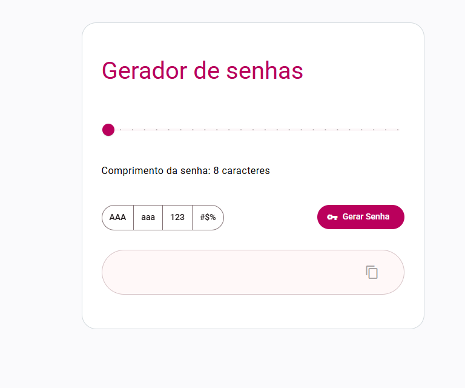

# 🔐 Gerador de Senhas com Angular

Desafio 2/10

Este é um aplicativo simples de de gerador de senhas criado com **Angular** e **Angular Material**, onde o usuário pode gerar uma senha aleatória entre 8 a 32 caracteres podendo incluir Letras Maiúsculas, Minúsculas, Números e Símbolos

## 🚀 Funcionalidades

- ✅ Gerar nova senha
- 🅰️ Selecionar quais letras, caracteres e simbolos pode estar na senha
- 📝Botão para copiar senha gerada

## 📦 Tecnologias usadas

- [Angular](https://angular.io/)
- [Angular Material](https://material.angular.io/)
- TypeScript
- HTML / CSS

## 🧑‍💻 Instalação

1. Clone o repositório:
```bash
git clone https://github.com/Tiesco789/password-gen.git
cd password-gen
```

2. Instale as dependências:
```bash
npm install
```

3. Rode o servidor de desenvolvimento:
```bash
ng serve
```

4. Acesse em `http://localhost:4200`

📸 Prévia


## 🧙‍♂️ Autor
Feito com 💙 por Franccesco Bordon
